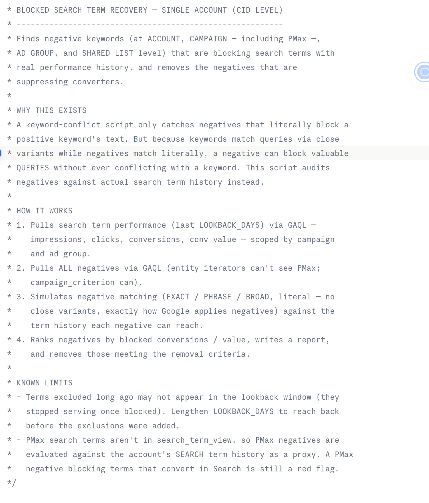
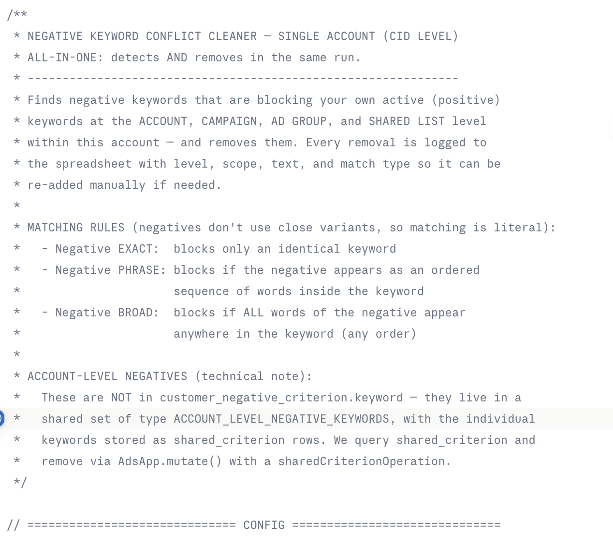

# Unblock Converted Keywords — Google Ads Scripts to Find & Remove Negative Keywords Blocking Your Best Search Terms

**Free open-source Google Ads Scripts that find negative keywords blocking your converting search terms — at the account, campaign (including Performance Max), ad group, and shared list level — and remove them automatically.**

Built by [John Williams](https://www.linkedin.com/in/johnwilliamsseo/) — founder of [AHMEEGO™](https://ahmeego.com) and [It All Started With A Idea LLC](https://itallstartedwithaidea.com), creator of [Buddy, the Google Ads AI agent](https://googleadsagent.ai), with 15+ years running paid media at major agencies and $350M+ in managed ad spend.

---

## The Problem These Scripts Solve

Negative keywords are supposed to block junk. But over time — through auto-applied recommendations, past managers, or old sculpting decisions — they end up **blocking search terms that convert**.

Worse, most "negative keyword conflict" tools miss this entirely, because of a matching asymmetry almost nobody accounts for:

> **Your keywords match queries loosely (close variants). Your negatives match literally.**

That means a negative like `"mens facial nyc"` can block a converting query even though it never literally conflicts with any keyword in your account. A keyword-level conflict checker sees nothing wrong. Meanwhile, revenue quietly disappears.

These scripts audit your negatives against **actual search term history** — impressions, clicks, conversions, conversion value — and surface (or remove) every negative that's sitting on money.

## What's Included

| Script | Level | What It Does |
|---|---|---|
| [`blocked_search_term_recovery.js`](scripts/blocked_search_term_recovery.js) | Single account (CID) | **The main event.** Audits every negative against your search term history and removes negatives blocking terms with conversion history. Sees PMax campaign negatives via GAQL. |
| [`cid_negative_conflict_cleaner.js`](scripts/cid_negative_conflict_cleaner.js) | Single account (CID) | Classic conflict checker + remover: finds negatives literally blocking your positive keywords across all four levels. |
| [`mcc_negative_conflict_cleaner.js`](scripts/mcc_negative_conflict_cleaner.js) | MCC / Manager account | The conflict cleaner, parallelized across up to 50 client accounts per run. |

## Quick Start (2 minutes)

1. Open Google Ads → **Tools & Settings → Bulk Actions → Scripts**
2. Click **+**, paste the script, and authorize
3. Create a blank Google Sheet, paste its URL into `CONFIG.SPREADSHEET_URL`
4. Set `DRY_RUN: true` and **Preview** — review the report it writes to your sheet
5. Flip `DRY_RUN: false` and run — every removal is logged with level, scope, text, and match type so anything can be re-added in seconds

Full walkthrough, config reference, and troubleshooting in the **[Wiki →](../../wiki)**

## Key Features

- **Performance Max coverage** — pulls campaign negatives via GAQL `campaign_criterion`, which sees PMax campaigns that `AdsApp.campaigns()` entity iterators cannot
- **Account-level negatives done right** — queries the `ACCOUNT_LEVEL_NEGATIVE_KEYWORDS` shared set via `shared_criterion` (they are *not* in `customer_negative_criterion.keyword`, a mistake that throws `QueryError.UNRECOGNIZED_FIELD`)
- **True negative match simulation** — exact/phrase/broad, literal matching with no close variants, exactly how Google applies negatives
- **Ranked by blocked revenue** — the report sorts by blocked conversions → conversion value → clicks, so the top row is your biggest recovery
- **Full audit trail** — every action logged to Google Sheets; nothing is ever removed silently
- **Guardrails** — dry-run mode, per-level removal toggles, and a threshold that skips negatives blocking 25+ keywords (usually intentional brand blockers)

## Real-World Result

This toolkit was built while auditing a live multi-location med-spa account, where dozens of converting search terms — `hydro facial nyc`, `facials upper east side`, `mens facial nyc` — were found excluded across Phrase, Performance Max, and AI Max campaigns. The recovery script identified and unblocked all of them in a single run, with a spreadsheet log of every change.

## Related Projects from AHMEEGO™

- **[Google Ads Placement Exclusions](https://github.com/itallstartedwithaidea/google-ads-exclusions-display-pmax-ads)** — sister toolkit: automated placement cleanup for Display, YouTube & Performance Max
- **[Buddy — Google Ads AI Agent](https://googleadsagent.ai)** — AI agent for Google Ads on web, iOS & Android
- **[google-ads-mcp](https://github.com/itallstartedwithaidea)** — MCP server for Google Ads
- **Free Google Ads Auditor** at [ahmeego.com](https://ahmeego.com)
- **r/ppc_** — our PPC community on Reddit: [reddit.com/r/ppc_](https://www.reddit.com/r/ppc_/)

## Keywords / Topics

`google-ads-script` · `negative-keywords` · `negative-keyword-conflicts` · `blocked-search-terms` · `unblock-converted-keywords` · `google-ads-automation` · `ppc` · `sem` · `performance-max` · `gaql` · `mcc-script` · `paid-search` · `ahmeego` · `itallstartedwithaidea`

## License

MIT — free for personal, client, and agency use. Attribution appreciated: link back to this repo or [ahmeego.com](https://ahmeego.com).

---

*Built with ☕ and 4:30 AM discipline in Queen Creek, Arizona. If this script recovered conversions for you, star the repo and share it in [r/ppc_](https://www.reddit.com/r/ppc_/).*
